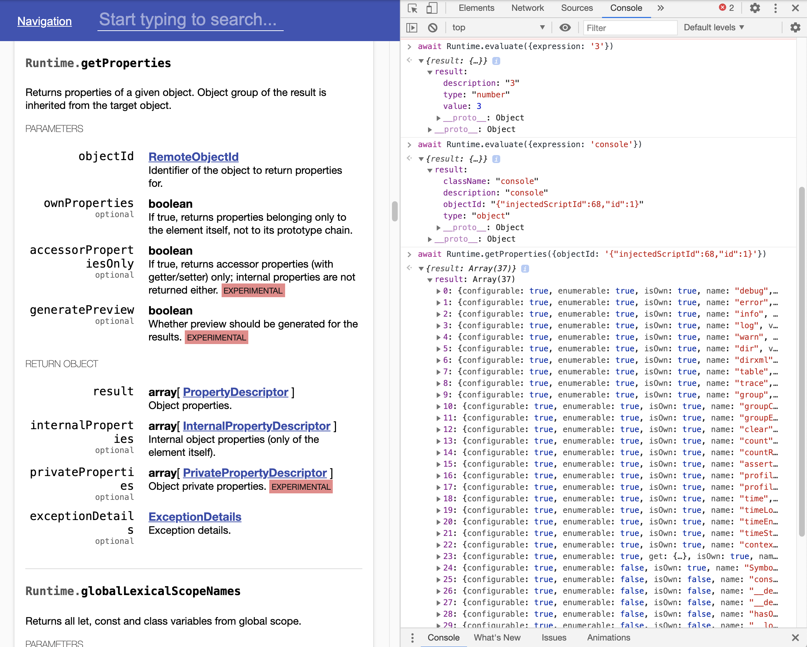

# playgroundize-devtools-protocol

(WIP) Chrome extension to turn [Chrome DevTools protocol
viewer](https://chromedevtools.github.io/devtools-protocol/) into
interactive playground.

Once the extension is installed, any time you go to those docs, you
can just open up the browser console and play with the API right
there. No need to hunt for the right extension REPL or wire things up
or whatever. No need to train yourself out of the habit of just
re-Googling the documentation and opening a new tab -- any tab with
the docs open will work.
